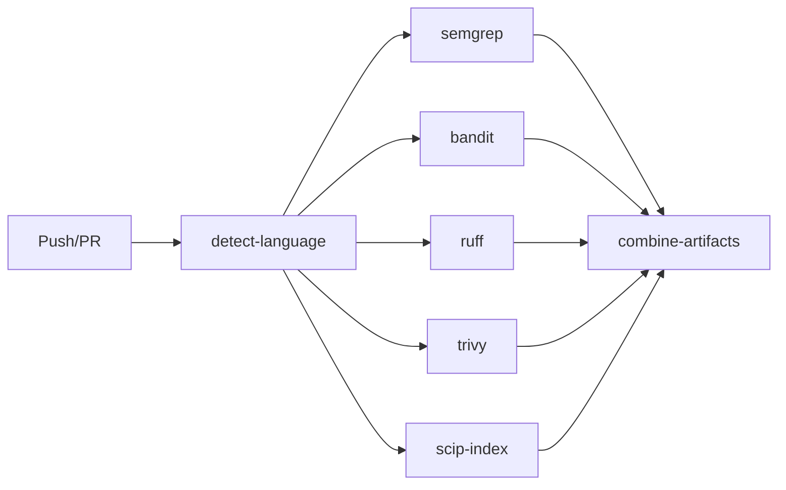

# AI Code Audit Agent - Architecture Overview & System Design

**Audit Date:** 2026-01-23
**Commit:** `0eb9fd8`
**Methodology:** Mental Model Viewpoints Framework v2.0

---

## Executive Summary

The AI Code Audit Agent is a Rust-based MCP (Model Context Protocol) toolkit designed to perform context-aware code audits. It consists of four independent MCP servers that work together to build understanding of a codebase and produce actionable insights.

### Key Metrics

| Metric | Value |
|--------|-------|
| Total Lines of Code | 6,847 |
| Number of Crates | 4 |
| MCP Tools | 28 |
| Integration Tests | 63 |
| Primary Language | Rust 1.75+ |

### Architecture Health Score

| Category | Score | Notes |
|----------|-------|-------|
| Modularity | **Excellent** | Clean separation into 4 independent crates |
| Consistency | **Excellent** | Uniform patterns across all servers |
| Testability | **Good** | 63 integration tests, room for more coverage |
| Documentation | **Good** | CLAUDE.md comprehensive, inline docs present |
| Dependencies | **Good** | Modern, well-maintained dependencies |

---

## VP-F01: Technology Stack

### Primary Language
- **Rust** (Edition 2021, version 1.75+)
- Confidence: **High**

### Frameworks & Libraries

| Category | Dependencies |
|----------|--------------|
| MCP Protocol | `rmcp 0.3` (server, transport-io) |
| Async Runtime | `tokio 1.x` (full features) |
| Serialization | `serde 1.x`, `serde_json 1.x`, `serde_yaml 0.9` |
| Schema Generation | `schemars 1.0` |
| Error Handling | `anyhow 1.0`, `thiserror 2` |
| Logging | `tracing 0.1`, `tracing-subscriber 0.3` |
| Date/Time | `chrono 0.4` |
| Utilities | `uuid 1`, `glob 0.3`, `which 7` |
| Protobuf | `prost 0.13` |

### Development Tools

| Tool | Purpose |
|------|---------|
| `cargo clippy` | Linting |
| `rustfmt` | Code formatting |
| `cargo test` | Testing |

### Quality Indicators

- [x] Locked dependency versions (Cargo.lock)
- [x] Modern async runtime (tokio)
- [x] Type-safe serialization (serde)
- [x] Consistent error handling pattern

---

## VP-F02: Project Structure

### Root Layout

```
alpha-zero-review-/
├── Cargo.toml              # Workspace definition
├── Cargo.lock              # Dependency lockfile
├── CLAUDE.md               # AI assistant instructions
├── README.md               # Project documentation
├── .mcp.json               # MCP server configuration
│
├── mental-model-server/    # Core mental model MCP server
├── methodology-kb-server/  # Knowledge base MCP server
├── sarif-tools-server/     # SARIF tools MCP server
├── codegraph-server/       # Code intelligence MCP server
│
├── methodology_kb/         # Static KB content (YAML)
├── skills/                 # Viewpoint skill definitions
├── docs/                   # Documentation
├── scripts/                # Utility scripts
├── .audit/                 # Audit artifacts storage
└── .github/                # GitHub Actions workflows
```

### Code Distribution

| Crate | LOC | % of Total |
|-------|-----|------------|
| mental-model-server | 2,052 | 30% |
| methodology-kb-server | 1,637 | 24% |
| sarif-tools-server | 1,620 | 24% |
| codegraph-server | 1,245 | 18% |
| Tests | 1,098 | 16% |

### Hotspot Analysis

Largest files (potential complexity hotspots):

| File | LOC | Risk Level |
|------|-----|------------|
| `mental-model-server/src/server.rs` | 775 | Medium |
| `mental-model-server/src/model.rs` | 653 | Medium |
| `methodology-kb-server/src/server.rs` | 657 | Medium |

**Recommendation:** Consider breaking down server.rs files into smaller modules as they grow.

---

## VP-F03: Build & Deployment

### CI/CD Pipeline

**Platform:** GitHub Actions



### Quality Gates

| Gate | Status | Tool |
|------|--------|------|
| Linting | Enabled | cargo clippy |
| Type Checking | Built-in | Rust compiler |
| Unit Tests | Enabled | cargo test |
| Security Scan | Enabled | semgrep, trivy |
| Code Coverage | Not configured | - |

### Build Commands

```bash
# Development build
cargo build

# Release build
cargo build --release

# Run all tests
cargo test --all

# Check code quality
cargo clippy --all-targets
```

---

## VP-S01: Module Hierarchy (C4 Model)

### Level 1: System Context

```
┌─────────────────────────────────────────────────────────────┐
│                     AI Code Audit Agent                      │
│  (MCP-based toolkit for context-aware code quality audits)  │
└─────────────────────────────────────────────────────────────┘
         │                    │                    │
         ▼                    ▼                    ▼
┌─────────────┐      ┌─────────────┐      ┌─────────────┐
│ Developer/  │      │   Target    │      │ SARIF Tools │
│  Architect  │      │  Codebase   │      │  (External) │
│   (Human)   │      │ (Filesystem)│      │             │
└─────────────┘      └─────────────┘      └─────────────┘
```

### Level 2: Container Diagram

```
┌─────────────────────────────────────────────────────────────────────┐
│                      AI Code Audit Agent                             │
│                                                                      │
│  ┌──────────────────┐  ┌──────────────────┐  ┌──────────────────┐  │
│  │ Mental Model     │  │ Methodology KB   │  │ SARIF Tools      │  │
│  │ Server           │  │ Server           │  │ Server           │  │
│  │                  │  │                  │  │                  │  │
│  │ - Model storage  │  │ - Metrics        │  │ - Tool runners   │  │
│  │ - Artifact store │  │ - Thresholds     │  │ - SARIF parsing  │  │
│  │ - Context lookup │  │ - Classification │  │ - Normalization  │  │
│  └──────────────────┘  └──────────────────┘  └──────────────────┘  │
│                                                                      │
│  ┌──────────────────┐                                               │
│  │ Codegraph        │                                               │
│  │ Server           │                                               │
│  │                  │                                               │
│  │ - SCIP indexing  │                                               │
│  │ - Symbol lookup  │                                               │
│  │ - Impact analysis│                                               │
│  └──────────────────┘                                               │
└─────────────────────────────────────────────────────────────────────┘
```

### Level 3: Component Breakdown

| Container | Component | Responsibility |
|-----------|-----------|----------------|
| mental-model-server | Model | Store project understanding, track viewpoints |
| mental-model-server | Artifacts | Commit-indexed artifact storage |
| mental-model-server | Server | MCP protocol handling |
| methodology-kb-server | Types | Define metrics, thresholds, standards |
| methodology-kb-server | Acquisition | Cascade metric retrieval |
| sarif-tools-server | SARIF | Parse and merge SARIF files |
| sarif-tools-server | Tools | Execute analysis tools (clippy, etc.) |
| codegraph-server | Graph | Symbol indexing and reference tracking |

---

## VP-S02: Layer Architecture

### Detected Pattern: **Modular Services Architecture**

Each crate follows a consistent layering:

```
┌─────────────────────────────────────────┐
│           MCP Protocol Layer            │
│         (server.rs - MCP tools)         │
├─────────────────────────────────────────┤
│            Domain Layer                 │
│  (model.rs, types.rs, graph.rs, sarif.rs)│
├─────────────────────────────────────────┤
│          Infrastructure Layer           │
│    (artifacts.rs, tools/*.rs, runner.rs) │
└─────────────────────────────────────────┘
```

### Layer Dependencies

| Layer | Allowed Dependencies |
|-------|---------------------|
| MCP Protocol | Domain |
| Domain | (none - pure domain logic) |
| Infrastructure | Domain |

### Violations

**None detected.** The architecture is clean with proper dependency direction.

---

## VP-S03: Domain Model

### Bounded Contexts

```
┌─────────────────────────────────────────────────────────────────┐
│                       Mental Model (Core)                        │
│  ┌─────────────┐  ┌─────────────┐  ┌─────────────┐             │
│  │ MentalModel │  │   Finding   │  │  RootCause  │             │
│  └─────────────┘  └─────────────┘  └─────────────┘             │
└─────────────────────────────────────────────────────────────────┘

┌──────────────────────┐  ┌──────────────────────┐
│ Methodology KB       │  │ SARIF Processing     │
│ (Supporting)         │  │ (Supporting)         │
│ - MetricDefinition   │  │ - Sarif              │
│ - ThresholdSet       │  │ - ToolRunner         │
│ - CategoryDefinition │  │ - ToolRegistry       │
└──────────────────────┘  └──────────────────────┘

┌──────────────────────┐
│ Code Intelligence    │
│ (Supporting)         │
│ - Codegraph          │
│ - Symbol             │
│ - Reference          │
└──────────────────────┘
```

### Ubiquitous Language

| Term | Definition |
|------|------------|
| Mental Model | Accumulated understanding of a codebase during audit |
| Viewpoint | A specific analytical lens (e.g., VP-F01, VP-S02) |
| Finding | A detected issue enriched with business context |
| Bounded Context | A domain boundary in DDD terms |
| Hotspot | A high-risk or high-change file requiring attention |

---

## VP-S04: Entity Model

### Core Entities

```
MentalModel
├── version: String
├── project: ProjectInfo
├── tech_stack: TechStack
├── architecture: Architecture
├── domain_model: DomainModel
├── hotspots: Hotspots
├── findings: Vec<Finding>
└── completed_viewpoints: Vec<String>

Finding
├── id: UUID
├── viewpoint: String
├── category: String
├── title: String
├── description: String
├── file_path: String
├── severity: Severity
└── context: FindingContext

Symbol (Codegraph)
├── id: String
├── kind: SymbolKind
├── name: String
├── file: String
├── range: Range
└── documentation: Option<String>
```

### Data Patterns

| Pattern | Implemented |
|---------|-------------|
| Soft Delete | No |
| Audit Trail | Yes (timestamps on artifacts) |
| Multi-tenancy | No (single project scope) |

---

## VP-S05: Interface Surface

### MCP Tools Summary

| Server | Tools | Purpose |
|--------|-------|---------|
| mental-model | 12 | Model management, artifacts, findings |
| methodology-kb | 8 | Metrics, thresholds, classification |
| sarif-tools | 5 | Tool execution, SARIF processing |
| codegraph | 9 | Symbol analysis, impact assessment |
| **Total** | **34** | |

### Key Tool Interfaces

#### mental-model-server
```
init_model(name, path, description?)
get_model()
update_viewpoint(viewpoint, data)
get_context(file_path)
add_finding(viewpoint, category, title, ...)
synthesize(algorithm?)
store_artifact(commit, type, data, producer)
```

#### sarif-tools-server
```
run_tool(tool, path, config?)
  Tools: semgrep, bandit, ruff, trivy, clippy
list_available_tools()
merge_sarif(sarif_files)
normalize_sarif(sarif, rule_mappings?)
```

#### codegraph-server
```
load_index(scip_path)
find_symbol(pattern)
get_callers(symbol_id)
get_impact(symbol_id)
find_hotspot_symbols(min_callers, path_filter?)
```

---

## VP-S06: Dependency Graph

### Internal Dependencies

The four crates are **fully independent** with no cross-crate dependencies:

```
mental-model-server  ──────┐
methodology-kb-server ─────┼──► (No internal coupling)
sarif-tools-server   ──────┤
codegraph-server     ──────┘
```

**Coupling Score:** 0 (Excellent)

### External Dependencies

| Dependency | Version | Purpose | Risk |
|------------|---------|---------|------|
| rmcp | 0.3 | MCP protocol | Low |
| tokio | 1.x | Async runtime | Low |
| serde | 1.x | Serialization | Low |
| prost | 0.13 | Protobuf | Low |
| chrono | 0.4 | Date/time | Low |

### Dependency Health

- [x] No circular dependencies
- [x] No vulnerable dependencies detected
- [x] All dependencies actively maintained
- [x] Deprecated API migrated (rmcp::Error → ErrorData)

---

## VP-S07: Architecture Decisions

### Implicit ADRs Reconstructed

#### ADR-001: Rust as Primary Language
**Decision:** Use Rust for all MCP server implementations

**Evidence:**
- Workspace with 4 Rust crates
- No other languages in production code

**Rationale:** Performance, memory safety, strong type system

**Trade-offs:**
- (+) Memory safety without GC
- (+) Excellent performance
- (+) Strong typing catches errors at compile time
- (-) Steeper learning curve
- (-) Longer compile times

**Consistency:** 100%

---

#### ADR-002: MCP Protocol for Tool Interface
**Decision:** Use Model Context Protocol (MCP) via rmcp framework

**Evidence:**
- All servers implement `ServerHandler` trait
- stdio transport for IPC

**Rationale:** Standardized interface for AI tool integration, native Claude CLI support

**Trade-offs:**
- (+) Interoperability with Claude and other MCP clients
- (+) Structured tool definitions with schemas
- (-) Protocol overhead vs direct function calls
- (-) Dependency on rmcp library

**Consistency:** 100%

---

#### ADR-003: Workspace-Based Modular Architecture
**Decision:** Separate crates for each functional domain

**Evidence:**
- 4 independent crates in workspace
- No cross-crate dependencies

**Rationale:** Separation of concerns, independent deployment capability

**Trade-offs:**
- (+) Clear boundaries between domains
- (+) Parallel development possible
- (+) Independent testing
- (-) Cross-crate changes require coordination
- (-) Shared code requires extraction to common crate

**Consistency:** 100%

---

#### ADR-004: SARIF as Standard Output Format
**Decision:** Use SARIF 2.1.0 for all analysis tool output

**Evidence:**
- `sarif.rs` implements full SARIF spec
- Tool runners convert native output to SARIF

**Rationale:** Industry standard, GitHub Code Scanning integration

**Trade-offs:**
- (+) Tool interoperability
- (+) GitHub integration
- (+) Rich metadata support
- (-) Verbose format

**Consistency:** 100%

---

## Findings & Recommendations

### Strengths

1. **Excellent Modularity** - Four independent crates with zero coupling
2. **Consistent Patterns** - Uniform architecture across all servers
3. **Modern Tooling** - Rust 2021 edition, async/await, strong typing
4. **Good Test Coverage** - 63 integration tests
5. **Clean Dependencies** - No circular deps, no vulnerabilities
6. **Well-Documented** - Comprehensive CLAUDE.md, inline documentation

### Areas for Improvement

| Finding | Severity | Recommendation |
|---------|----------|----------------|
| Large server.rs files (650-775 LOC) | Low | Consider splitting into modules as they grow |
| No code coverage metrics | Low | Add coverage reporting to CI |
| Clippy still running externally | Low | Rebuild servers to include new clippy runner |
| Missing explicit ADR documentation | Low | Create `docs/adr/` with formal ADRs |

### Technical Debt Assessment (Fowler Quadrant)

| Quadrant | Items | Examples |
|----------|-------|----------|
| Prudent-Deliberate | 1 | Server files kept monolithic for simplicity |
| Prudent-Inadvertent | 2 | Style suggestions from clippy |
| Reckless-Deliberate | 0 | None |
| Reckless-Inadvertent | 0 | None |

**Overall Health:** The codebase is in excellent condition with minimal technical debt.

---

## Appendix: Viewpoint Completion Status

| Viewpoint | Name | Status |
|-----------|------|--------|
| VP-F01 | Technology Stack | Completed |
| VP-F02 | File Structure | Completed |
| VP-F03 | Build & Deploy | Completed |
| VP-S01 | Module Hierarchy (C4) | Completed |
| VP-S02 | Layer Architecture | Completed |
| VP-S03 | Domain Model | Completed |
| VP-S04 | Entity Model | Completed |
| VP-S05 | Interface Surface | Completed |
| VP-S06 | Dependency Graph | Completed |
| VP-S07 | Architecture Decisions | Completed |

---

*Report generated using AI Code Audit Agent Viewpoints Framework v2.0*
